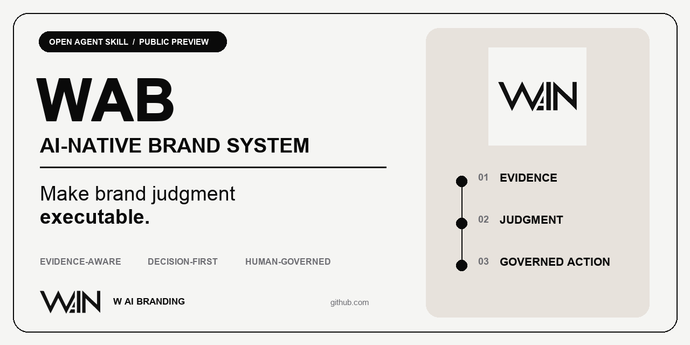
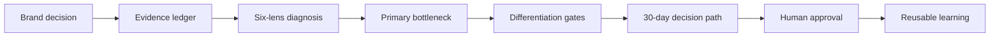
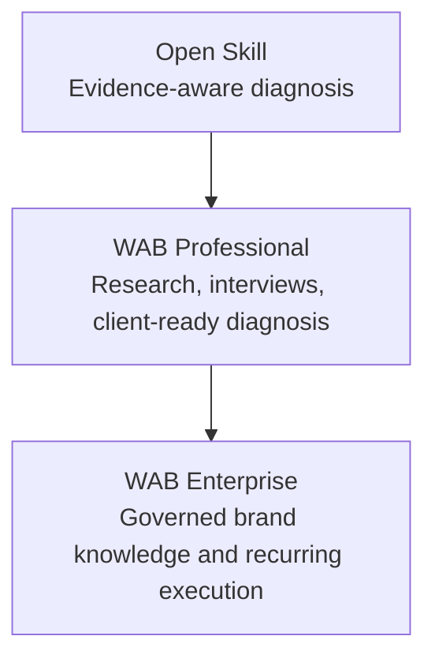

# WAB — AI-Native Brand Diagnosis



> **AI should not just create more brand content. It should make brand judgment executable.**

WAB is an evidence-aware Agent Skill that turns scattered brand claims, public market signals, operating constraints, and human judgment into one prioritized decision and an action-ready brief.

This repository contains the open diagnostic layer of the broader **W AI Branding (WAB)** system.

**Status:** Public preview · synthetic contract validation plus one owner-authorized exploratory field case · no claim of independent business-result validation

## The problem

Most AI marketing tools start after the important decisions have already been made:

- they generate content before the real brand problem is clear;
- they scale claims before evidence is separated from opinion;
- they optimize output while positioning, ownership, and review remain unstable;
- they preserve files, but not the judgment that made those files good.

The result is faster inconsistency.

WAB starts one layer earlier: **What decision must the organization make, what evidence supports it, and what should remain under human authority?**

## What the open Skill does

`wab-diagnose-brand` works on one brand and one consequential decision. It produces:

1. a bounded decision;
2. an auditable evidence ledger;
3. a six-lens brand-readiness assessment;
4. one primary bottleneck;
5. a differentiation hypothesis tested through four gates;
6. a 30-day action path;
7. explicit human decision and do-not-automate lists;
8. a route to self-serve validation, professional diagnosis, or an enterprise system.

It supports English and Chinese.

## Why it is AI Native

WAB is not a static questionnaire and not a prompt that asks a model to “act like a strategist.” It packages a governed operating method:



- **Evidence-aware:** facts, public observations, management claims, customer signals, hypotheses, conflicts, and gaps are not mixed together.
- **Decision-first:** the system selects one constraint instead of producing a generic list of “opportunities.”
- **Human-governed:** consequential claims, positioning, publication, budget, and knowledge updates remain under named human authority.
- **Machine-readable:** the output contract can be validated and handed to later workflows.
- **Progressively extensible:** the open diagnosis can lead to professional research, management interviews, brand knowledge, content and visual production, review, and feedback loops.

## Quick start

### Use as an Agent Skill

Copy or install the Skill folder into the skills directory supported by your agent:

```text
skills/wab-diagnose-brand/
├── SKILL.md
├── agents/openai.yaml
├── scripts/
├── references/
└── assets/
```

Then invoke it with a request such as:

```text
Use $wab-diagnose-brand to diagnose why our B2B brand produces content consistently but is still compared mainly on price. Separate confirmed facts from assumptions and give us one 30-day priority.
```

### Validate structured output

```bash
python3 skills/wab-diagnose-brand/scripts/validate_assessment.py \
  examples/harbor-kiln/assessment.json
```

Expected result:

```text
PASS
Evidence items: 6
Six lenses: 6/6
Differentiation gates: 4/4
Route: professional_diagnosis
```

Run the contract test suite:

```bash
python3 skills/wab-diagnose-brand/scripts/run_contract_tests.py \
  examples/harbor-kiln/assessment.json
```

## Examples and exploratory cases

The repository includes a fully synthetic example for **Harbor Kiln**, a fictional commercial tableware brand. It demonstrates the data contract without exposing a real customer, private evidence, or invented market results.

- [Synthetic assessment](examples/harbor-kiln/assessment.json)
- [Human-readable diagnosis](examples/harbor-kiln/diagnosis.md)

The first owner-authorized exploratory case examines **Daddy Asks**, a founder-owned parenting content and knowledge project. It demonstrates how recurring editorial judgment can become governed, reusable AI capability. System artifacts are owner-inspectable; performance figures remain management-reported until redacted source review.

- [Exploratory field case](case-studies/daddy-asks/README.md)
- [Evidence and privacy boundary](case-studies/daddy-asks/evidence-boundary.md)
- [Machine-readable assessment](case-studies/daddy-asks/assessment.json)

## Six diagnostic lenses

| Lens | Decision it supports |
| --- | --- |
| Position and difference | Why should this audience choose the brand over a realistic alternative? |
| Audience and choice barrier | What prevents the desired next action now? |
| Proof and credibility | Which claims are proportionate to current evidence? |
| Experience and consistency | Does the promise survive across touchpoints? |
| Knowledge and workflow | Can the capability run beyond one person? |
| Commercial signal and learning | Does the organization distinguish output from meaningful business evidence? |

Scores are not averaged into a vanity grade. The purpose is to locate the current constraint.

## Open core and commercial system



### Open Skill

For a bounded decision that can be assessed with available evidence. Use it to structure the problem, expose uncertainty, and design the next validation step.

### WAB Professional

For material conflicts, high-stakes positioning, management alignment, proprietary evidence, or a client-ready diagnosis. The professional layer adds facilitated research, interviews, judgment, and report quality control.

### WAB Enterprise

For organizations that need brand knowledge, content and visual production, review gates, permissions, feedback classification, and controlled capability retention across repeated work.

Installing the open Skill does **not** create an enterprise brand system or a WAB client engagement.

## What this repository deliberately does not publish

- the complete WAB private question tree;
- proprietary judgment and routing rules;
- real customer materials or internal evidence;
- private report-generation and delivery workflows;
- production-account access, payment, publishing, or knowledge-base write tools;
- claims of revenue, reach, conversion, workforce replacement, or validated causality.

The goal of the open core is to make the method inspectable and useful while preserving the professional system required for high-consequence work.

## Trust and safety

- Never invent facts or silently resolve conflicts.
- Never treat public information as client-confirmed truth.
- Never publish, spend, or update formal knowledge without human authorization.
- Never use one customer's data to improve another customer's output without explicit authority.
- Escalate regulated claims, copyright, privacy, and legal decisions.

See [Security and privacy](docs/security-and-privacy.md).

The public validation method is documented in [Evaluation protocol](docs/evaluation.md).

## Project structure

```text
.
├── README.md
├── docs/
│   ├── architecture.md
│   ├── commercial-model.md
│   ├── evaluation.md
│   └── security-and-privacy.md
├── examples/
│   └── harbor-kiln/
├── case-studies/
│   └── daddy-asks/
├── distribution/
│   └── daddy-asks/
└── skills/
    └── wab-diagnose-brand/
        ├── SKILL.md
        ├── agents/openai.yaml
        ├── assets/
        ├── references/
        └── scripts/
```

## Release and evidence status

Version 0.1.0 has been released with structured schemas, failure gates, and synthetic end-to-end tests. The Daddy Asks package adds an owner-authorized exploratory field case, but it is not independent customer or business-impact validation.

Until independently reviewed field evidence is documented, describe the project as:

> An open, evidence-aware brand-diagnosis Skill in public preview, available for critique and field validation.

Do not describe it as academically validated, universally applicable, or proven to improve business performance.

See [CHANGELOG](CHANGELOG.md), [CONTRIBUTING](CONTRIBUTING.md), and [CITATION.cff](CITATION.cff) for release, contribution, and citation details.

## About WAB

**W AI Branding (WAB)** is an AI Native brand marketing system developed by **Zhiying Zhong**, a Chinese entrepreneur and brand operator with 20 years of marketing practice. WAB explores how selected parts of brand judgment can become governed, reusable organizational capability without removing human authority or responsibility.

## License and commercial use

The public Skill, scripts, schemas, documentation, and synthetic examples are licensed under [Apache License 2.0](LICENSE).

The license does not grant permission to use WIN or WAB names, logos, visual identity, or confusingly similar marks as a third-party product identity, endorsement, certification, resale brand, or client-facing WAB service. Customer data, private WAB judgment rules, professional delivery workflows, and enterprise operating systems are not included in this repository. See [TRADEMARKS](TRADEMARKS.md) and [NOTICE](NOTICE).

---

### 中文简介

WAB不是“帮企业多生成内容”的Prompt，而是一套先判断真实品牌问题、区分事实与假设、选择一个关键瓶颈，并明确人工责任与下一步行动的AI原生品牌诊断Skill。

当前仓库公开的是可运行的诊断入口；完整调研、管理层深访、专业报告、企业品牌知识和持续内容视觉系统属于WAB专业与企业服务层。
