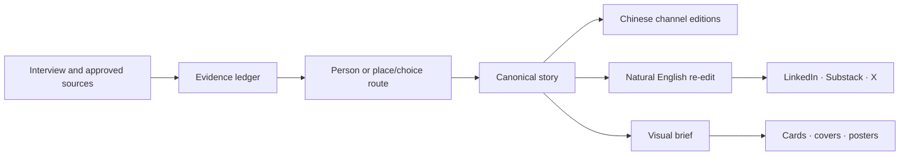

# From Interview Audio to Multiplatform Story Assets

> An organization-authorized exploratory case based only on the public-facing editorial patterns of 《即莞来》 and 《选择东莞》.

## Case status

- **Organization:** 东莞市人才资源发展促进会
- **Public scope:** the two editorial series 《即莞来》 and 《选择东莞》 only
- **Capability in scope:** interview audio or notes → transcript → evidence-linked story → Chinese and natural-English editions → channel-specific text → visual briefs and brand-ready posters/cards
- **Status:** exploratory field case; not independently audited
- **Privacy posture:** no raw recording, full transcript, unpublished article, private source index, interviewee identity, contact detail, portrait, account record, internal task count, or organization-wide governance file is included
- **Publication status:** repository package and channel drafts require final human approval before public release

## The visible output hides the real work

An interview may eventually appear as a long article, a LinkedIn post, a Substack field note, an X thread, a WeChat story, a quotation card, or a poster.

That can make the workflow look simple:

```text
audio → transcription → content
```

The real production chain is stricter:

```text
interview audio or notes
→ time-coded transcript
→ cleaned working transcript
→ source and evidence ledger
→ story-route decision
→ editorial diagnosis
→ approved canonical story
→ Chinese platform adaptations
→ natural English re-edit
→ international platform adaptations
→ visual brief
→ branded cards or posters
→ human publication decision
```

A transcript is evidence, not an article. A translation is not platform adaptation. A generated image is not automatically a trustworthy editorial visual.

## Two routes, not one template

The public case exposes only two content routes.

### 《即莞来》 — a person-led story

The person is irreplaceable. The article asks what this person chose, how they judged the situation, what the choice cost, and how it connects to Dongguan, an industry, or a changing time.

The primary evidence is the interview itself: the original recording, the time-coded transcript, confirmed facts, and traceable quotations.

The Skill must not turn the interview into a resume, a corporate profile, a success myth, or proof of a group trend. Before drafting, it separates facts, direct quotations, paraphrases, editorial interpretation, conflicts, and sensitive material. It then proposes defensible story directions before building one canonical story.

### 《选择东莞》 — a place/choice story

The central question is different: what should a reader understand before choosing Dongguan for work, entrepreneurship, life, or long-term development?

An interview may reveal the question or provide a bounded case, but it cannot establish current city conditions by itself. The primary evidence must be rebuilt from current public and authoritative sources. Completed facts, active policy, work in progress, future plans, and editorial judgment remain separate.

This route can be positive without becoming promotional. It does not invent advantages, present plans as completed results, or generalize one person's outcome to everyone.

## One canonical story, many real adaptations

The system does not ask a model to translate one post and resize one image.

Every derivative returns to the same approved canonical story and evidence ledger:



The language layer preserves fact certainty, speaker agency, quotation status, and time state while changing sentence rhythm and context for international readers. The platform layer changes hook, length, structure, and call to action without changing the evidence.

## Visuals come after editorial judgment

The visual process starts only when the story is stable.

The Skill first asks what is genuinely worth visualizing: a person's defining choice, a verified quotation, a before/after relationship, a place-choice mechanism, or a small set of evidence-backed facts. It then inherits the current brand system and chooses the appropriate form—cover, portrait card, quotation card, editorial illustration, explainer, or poster.

Real portraits, supplied photographs, logos, recognizable places, exact quotations, and data require their own source and rights checks. Generative imagery may create an editorial illustration or background; it must not fabricate a real person, event, policy, or city feature and present it as documentary evidence.

## The open Skill

This case led to the public-preview Skill [`wab-interview-to-story`](../../skills/wab-interview-to-story/).

The Skill includes:

- an interview-to-story workflow;
- evidence and rights gates;
- two explicit editorial routes;
- domestic and international platform contracts;
- a visual handoff contract;
- a machine-readable story-package schema;
- a dependency-free validator;
- positive and negative contract tests;
- a fictional sample package.

It is useful as a bounded open workflow. A recurring organizational implementation still requires project-specific editorial rules, brand assets, permissions, source systems, account governance, and human decision-makers.

## What current evidence supports

The current evidence supports this bounded statement:

> Two recurring editorial patterns have been converted into an inspectable Skill that can transform interview material into source-linked, multilingual, channel-specific story and visual packages while retaining explicit human gates.

The evidence does **not** yet establish that:

- the Skill improves reach, conversion, trust, or organizational efficiency;
- automatic transcription is accurate without human review;
- an English derivative has been validated by its target audience;
- the same workflow transfers to another organization without adaptation;
- generated visuals have publication rights simply because they were produced;
- installing the open Skill creates a complete content or brand operating system.

## What WAB diagnosed

The primary bottleneck is **proof and credibility**.

The proposition is now clear: this is not a transcription tool or a generic content repurposer. It is an evidence-aware story-production capability. The next risk is making the public claim larger than the public evidence.

The best next proof is not an internal architecture diagram. It is one privacy-safe before/after package for each route:

1. a redacted source excerpt or synthetic equivalent;
2. the evidence ledger;
3. the route decision;
4. the canonical story;
5. one Chinese and one English platform adaptation;
6. one reviewed visual asset;
7. the human corrections and failure log.

See the [human-readable WAB diagnosis](diagnosis.md), [machine-readable assessment](assessment.json), and [evidence and privacy boundary](evidence-boundary.md).

## Next 30 days

1. Freeze the public product name and the exact two-route claim.
2. Build one fully synthetic contract example and two redacted field demonstrations—one for each approved series.
3. Measure unsupported-claim rate, quotation errors, required human corrections, production time, and cross-channel consistency against a prompt-only baseline.
4. Ask an English editor and an external organizational operator to review the same package.
5. Publish only after the organization approves the redactions, visual rights, and final public wording.

The commercial promise should remain disciplined:

> One interview can become many assets. One approved truth should remain behind all of them.
